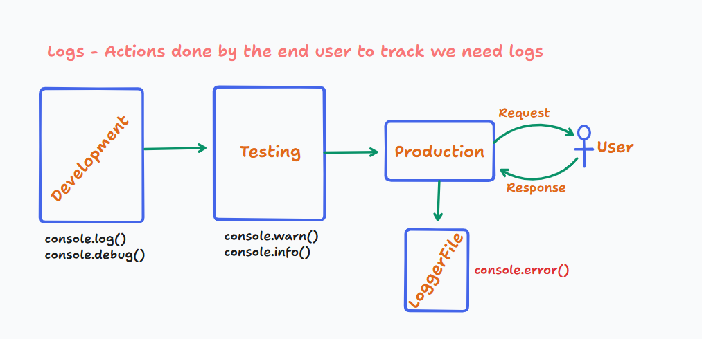
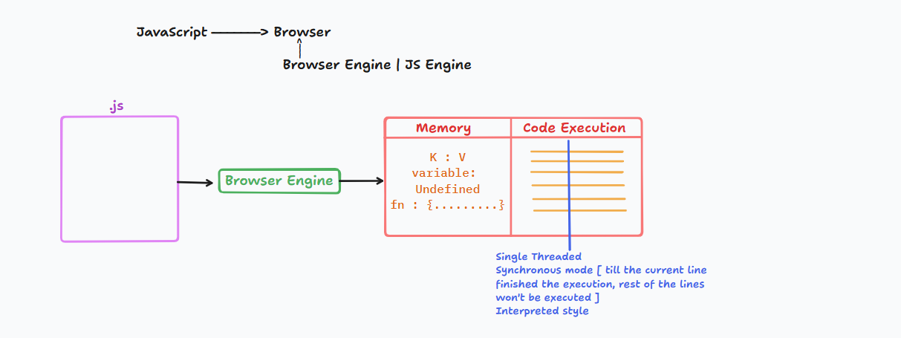
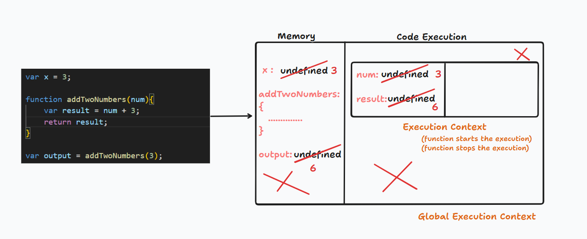
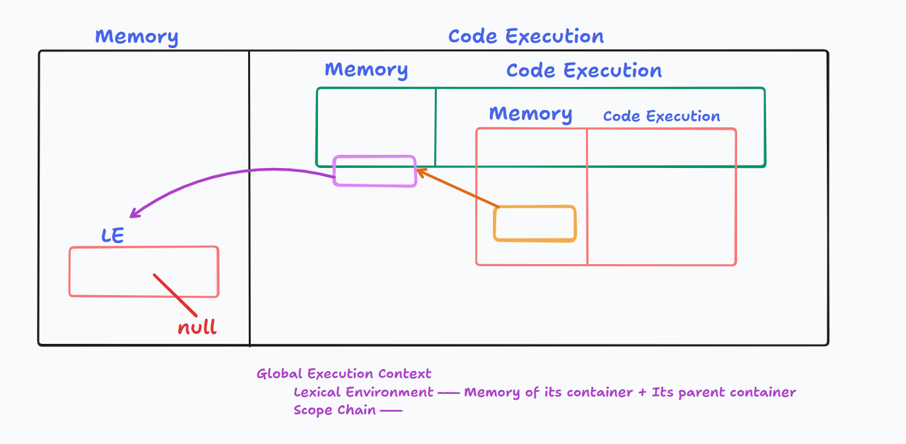
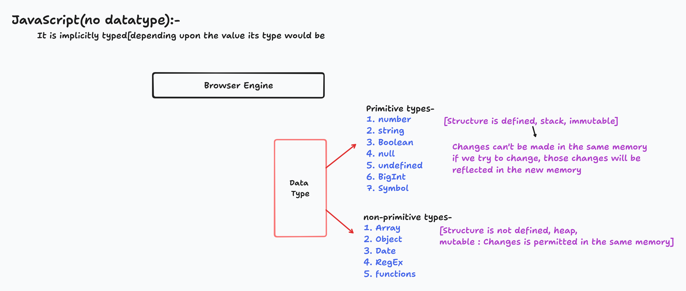
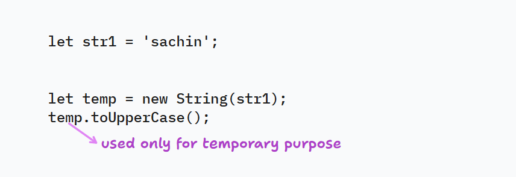

--- Class 3 (25/03/2025) -----
---
- Working with iterator called "forEach"

-> It can be used only on Array Objects.

```JS
callbackFunction = (value, index, arr) => {

};
forEach(callbackFunction)
```

<b> 1. document.getElementByClassName() : HTMLCollection[] :-</b>

How to convert HTMLCollection to Array ?<br>
Ans. arrayElements = Array.from(HTMLCollection)

<b> 2. document.getElementsByTagName() : HTMLCollection :-</b>
- Another approach to convert HTMLCollection to Array `[...HTMLCollection]`.

<b> 3. document.getElementsByName : NodeList</b>
While working with NodeList, directly we can use forEach() without conversion

<b> 4. Instead of remembering all these methods, we go for a method called `QuerySelector`(cssSelector) | `QuerySelectorAll`(cssSelector) </b>

querySelector(cssSelector) : Element
querySelectorAll(cssSelector) : NodeList

Que. Why do we need so many methods to target HTML Page using JS, when we can target directly with single method call `querySelectorXXX()` ?

Ans. Older version of JS added methods like <br> 
getElementBYId(), getElementByClassName(),.....

As CSS became popular, to give the direct support of accessing the elemnts using CSS methods like querySelector() and querySelectorAll().

querySelector() | querySelectorAll() | getElementById() ===> Works only for static DOM

getElementByClassName() | getElementByTagName() | getElementByName() ===> Dynamic DOM

### JS Output Techniques :-
1. alert()
2. confirm()
3. document.write() | document.writeln()
4. innerHTML | outerHTML
5. innerText | outerText
6. textContent
7. console.XXXXX() [log(), warn(), error(), info(), debug()]

#### alert(msg) void :-
- It has an ok button
- It returns undefined when user clicksok button | presses 'esc' key
- It is used to just display some message

<b> Limitation :- </b>


#### confirm(msg) -- boolean


#### <b><u>document.write() | document.writeln() :-</b></u>
```
<h1>Hello World !!</h1>
<button onclick="addContent()">Add Content</button>

```

Output :-


#### <b><u>innerHTML Vs outerHTML :-</u></b>
innerHTML : It will add the element as a child to the targeted container|element
outerHTML : It will replace the element with the newly provided one to the tageted container|element

```HTML
<!DOCTYPE html>
<html lang="en">
<head>
    <meta charset="UTF-8">
    <meta name="viewport" content="width=device-width, initial-scale=1.0">
    <title>Document</title>
</head>
<body>
    <button onclick="deleteRecord()">Delete</button>
    <h1></h1>
    <p></p>

    <script type="text/javascript">
        function deleteRecord(){
            flag = confirm("Are you sure you want to delete this record?");
            if(flag == true){
                // document.querySelector("h1").innerHTML = '<h1 style="color:green;">Record Deleted</h1>';
                document.querySelector("h1").outerHTML = '<h2 style="color:green;">Record Deleted</h2>';

                // document.querySelector("h1").remove(); // This will remove the h1 element from the DOM
                // document.querySelector("h1").innerHTML = ""; // This will clear the content of the h1 element
                // document.querySelector("h1").outerHTML = ""; // This will remove the h1 element and its content from the DOM
            }else{
                // document.querySelector("p").innerHTML = '<h1 style="color:red;">Record Not Deleted</h1>';
                document.querySelector("p").outerHTML = '<h2 style="color:red;">Record Not Deleted</h2>';
            }
        }
    </script>
</body>
</html>
```

#### <b><u>innerText Vs textContent :-</u></b>
Same as innerHTML and outerHTMl but in case of innerText or outerText we can just present only text content not any HTML + styles.


```HTML
<!DOCTYPE html>
<html lang="en">
<head>
    <meta charset="UTF-8">
    <meta name="viewport" content="width=device-width, initial-scale=1.0">
    <title>Document</title>
</head>
<body>
    <button onclick="deleteRecord()">Delete</button>
    <h1></h1>
    <p></p>

    <script type="text/javascript">
        function deleteRecord(){
            flag = confirm("Are you sure you want to delete this record?");
            if(flag == true){
                document.querySelector("h1").textContent = 'Record Deleted';

            
            }else{
                document.querySelector("p").innerText = 'Record Not Deleted';
            }
        }
    </script>
</body>
</html>
```




### JS Input Mechanism :-
1. prompt() :-

- return type -- String.

- if user enters the data and click on ok button : 'data'
- if user doesn't enter but clicks on ok button : ' '
- if user clicks on cancel button or esc button with | without entering the data : null

2. queryString :-
- It is a combination of URL + queryParameters(K, V)
- To collect the


<!----Class 6-->



```JS
var x = 3;

function addTwoNumbers(num){
    var result = num + 3;
    return result;
}

var output = addTwoNumbers(3);
```



## Hoisting :-
var : It supports hoisting.

It is a phenomenon in JavaScript where variables and functions are moved to the top of their scope before the code is executed. They can be used without initialization. If var variable holds function expression | arrow function then such variables can't be used without initialization, if we try it would result in `TypeError`.

1. `var` : 
- It supports hoisting.
- It can be used without initialization.
- It supports hoisting with 'undefined' as the value.
- Redeclaring the same variable is possible.
- It is function scoped.

2. `let` :
- It support hoisting [Variable would be in 'Temporal Dead Zone' : It can be used without initializing] <br> If we try to use variable present in temporal dead zone then it would result in `ReferenceError` : variable cant't be accesse without initialization.
- Redeclaring the same variable is not possible.
- Reassignment of value to a variable is possible.
- It is block scoped.[Can't be used outside the block in which it is declared]
- It support shadowing.


|Feature|var|let|const|
| --- | --- | --- | --- |
|Scope|Function-scope|Block-scoped|Block-Scoped|
|Hoisting|Yes(Initialized as undefined)|Yes(but not initialized)|Yes(But not initialized)|
|Redeclaration|Yes|No|No|
|Reassignment|Yes|Yes|No|
|Temporal Dead Zone|No|Yes|Yes|
|Used in Loops|Not Safe(due to function scope)|Safe|Safe(if not reassigned)|
|Global Object Property|Yes(if declared globally)|No|No|


## Basics of function :-
```JS
var x = 1; // global scope, value of x is 1
a(); // a is a function, it is called, value of x is 1 
b(); // b is a function, it is called, value of x is 1

function a(){
    var x = 2; // local scope, value of x is 2 
    console.log(x); 
}

function b(){
    var x = 3; // local scope, value of x is 3
    console.log(x); 
}

console.log(x); // value of x is 1, as it is in global scope and not affected by a() and b()
```

```JS
var b = 3;
function a(){
    console.log(b); // undefined, as it is in global scope and not initialized yet 
    console.log(this.b);
    console.log(window.b);
    window.b = 100;
}

a();
console.log(b); 
```



## Rules to name a variable :-
1. Must start with a letter, underscore(_) or dollar sign($).
2. _ is used for configurations lot of constructs.<br> _ refers thaa the variables requires further implementation.<br> var productName; // Its functionality is final<br> var _productName; // Representation:It is not yet implemented.
3. Don't use special characters ( like @,#,$,%,^,&,*,(,) ).in the variable name.[Suggested by ECMA -262 standard].
4. Name can be alpha numeric.<br> var product202020;
5. Name is acse sensitive.
6. Name can be max 255 characters long.
7. Avoid using single char and long variable name.
8. Avoid using keywords[Total 51 keywords].
<br>var const; //invalid
<br>var if; //invalid

9. Always use camelCase for name and it should be meaningful.
10. Avoid using same name for different variables.



## JavaScript Objects Vs JSON :-
JS Object = { K : V }<br>
convert javascrpt object to json = JSON.stringify(obj)

JSON = { "K" : "V" }<br>
convert string representation json to javascript object = JSON.parse(json)

```HTML
<!DOCTYPE html>
<html lang="en">
<head>
    <meta charset="UTF-8">
    <meta name="viewport" content="width=device-width, initial-scale=1.0">
    <title>Document</title>
    <script>
        let user = {
            name: "John Doe",
            age: 30,
            country: "USA",
            hobbies: ["reading", "gaming"],
            isActive: true,
            address: {
                street: "123 Main St",
                city: "New York",
                zipCode: "10001"
            }
        };
        console.log(user); //mutable

        let jsonUser = JSON.stringify(user);
        console.log(jsonUser); //string

        console.log(typeof jsonUser); //string
        console.log(typeof user); //object

        
    </script>
</head>
<body>
    
</body>
</html>
```

## Number Data Type:-
JavaScript stores all numbers (whether typed by the user or written in code) using IEEE 754 double-precision floating point format (64-bit float).

|Bits|Purpose|
|---|---|
|1 bit|Sign(0=Positive, 1=Negative) |
|11 bits|Exponent (biased by 1023) |
|52 bits|Mantissa (fractional part) |

|Concept|JavaScript|
|---|---|
|Max Safe Integer|2^53 -1 (9007199254740991) |
|Precision Above Limit| Lost|
|Alternative|BigInt|

### To convert the data from string to number:-
We have 3 mechanism.

1. parseInt() | parseFloat()
2. Number()


### Local encide currency :-
|Country|Locale Code|Currency Code|
|---|---|---|
|United States|"en-US"|"USD"|
|Germany|"de-DE"|"EUR"|
|Japan|"ja-JP"|
|India|"en-IN"|"INR"|
|United Kingdom|

### Number() :-


### String in JavaScript :-
1. String in JS can be creted in 3 ways-
- By using single quotes.
- By using double quotes.
- By using backticks.

``` JS
let str1 = "Hello World!"; 
let str2 = 'Hello World!'; // used internally by JS engine
let str3 = `Hello World!`; // used by developers for template literals/binding

console.log(typeof str1, typeof str2, typeof str3); // string string string
console.log(str1, str2, str3); // Hello World! Hello World! Hello World!

```

```JS
let str1 = 'sachin'; // primitive string

let str2 =  new String('dhoni'); // object

console.log(str1.toUpperCase());  

str1.country = 'IND'; // primitive string cannot have properties
console.log(str1); // string primitive

str2.country = 'IND';
console.log(str2); // [String: 'dhoni'] { country: 'IND' }

```


