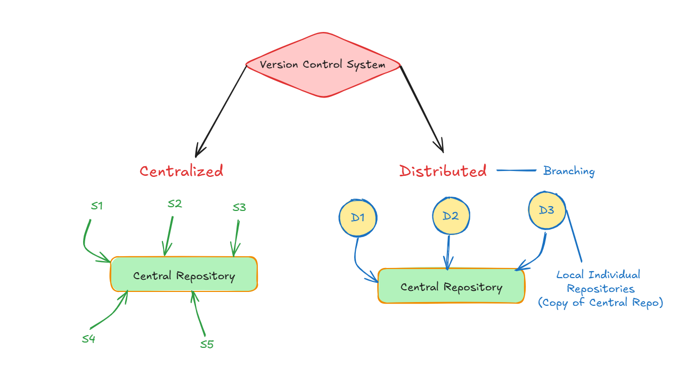
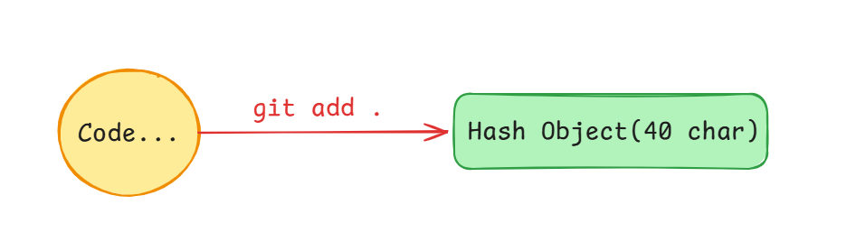
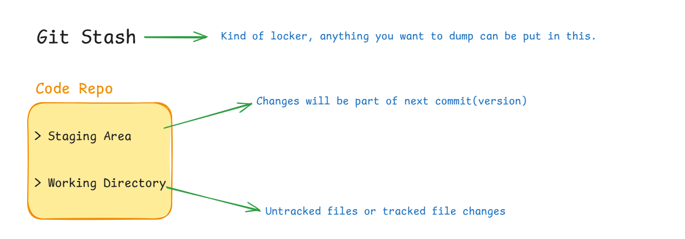

# Version Control System :-
To evolve sofware and improve functionality we step by step add more code and when we have significant change to rollout, we release a new version of the software.

- It helps to manage release of new version
- It helps to manage rollback to old version
- It helps to manage who wrote which piece of code.
- It helps to manage version/snapshots that can be later referred.

Eg.- Git, SVN, CVS, Mercurial, Perforce etc.

## Git as Version Control System --
- Open Source VCS
- Fast and reliable
- Industry Standard
- Distributed VCS


<b>1. Centralized VCS :-</b>
- All changes are made to a central repository
- All developers access the central repository to make changes
- If central repository is down, no one can make changes.
- Eg.- SVN, CVS

<b>2. Distributed VCS :-</b>
- Each developer has a local copy of the repository
- Each developer can make changes to their local copy, then push changes to central repository
- If central repository is down, developers can still make changes and push later.
- Eg.- Git, Mercurial



### Need and advantages we get by using Git -
- **Need :-** We need a system that can handle large number of developers working on same project .

- **Advantages :-**
- Historical changes can be tracked
- Backup and disaster recovery
- Code review and quality assistance
- Experimentataion and rollback
- Collaboration and team management
- Conflict resolution and merge

## Git Internals :-

### How to use Git -
- **git init :** Initialize a new Git repository(Enabling Git in project)
- **git add <filename> :** Add file to staging area 
- **git commit -m "message" :** Commit file to repository
- **git log :** Show commit history
- **git branch <branchname> :** Create new branch
- **git checkout <branchname> :** Switch to branch
- **git merge <branchname> :** Merge branch into current branch 
- **git remote add <name> <url> :** Add remote repository
- **git push <name> <branchname> :** Push local branch to remote repository
- **git pull <name> <branchname> :** Pull remote branch to local repository
- **git status :** Show status of repository
- **git diff :** Show differences between files
- **git reset <filename> :** Unstage file
- **git rm <filename> :** Delete file from repository
- **git tag <tagname> :** Create new tag
- **git branch -d <branchname> :** Delete branch
- **git branch -m <oldname> <newname> :** Rename branch
- **git branch -a :** Show all branches

### Understanding Git :-
1. **Working directory :** This is the directory where you are currently working on your project. This is where you make changes to your files.
2. **Staging area :** This is a temporary storage area where you stage your changes before you commit them to the repository. This is where you add files to be committed. 
3. **Repository(local) :** This is the local copy of the repository on your machine. This is where all your commits are stored . 
4. **Remote repository :** This is the central repository where all the developers push their changes. This is where all the commits are stored . 
5. **Branches :** These are different versions of your project. You can have multiple branches for different features or versions of your project. Eg.- GitHub, GitLab, Bitbucket. 
6. **Commits :** These are the snapshots of your project at a particular point in time. You can think of commits as a save point in your project. 

### Git Vs GitHub :-
- **Git :-** Git is a version control system that allows you to track changes in your code over time. It is a local repository that you can use to manage your code. 
- **GitHub :-** GitHub is a web-based platform that allows you to host and manage your Git repositories. It provides features such as code review, project management, and collaboration tools. 

#### Making a new Repo on Github :-
1. Go to github.com and sign in to your account.
2. Click on the "+" button in the top right corner of the page. 
3. Select "New repository" from the dropdown menu.
4. Enter a name for your repository and add a description.
5. Choose whether you want your repository to be public or private. 
6. Click on the "Create repository" button.
7. Go to your local machine and run the command `git add remote origin <url>` to link your local repository to the remote repository on GitHub. 
8. Run the command `git push -u origin main` to push your local repository to the remote repository on GitHub. 
9. Go to your GitHub repository and you should see your repository listed. You can now clone th repository to your local machine by running the command `git clone <url>`. 

### Git Workflow :-
1. **Create a new branch :-** Create a new branch for your feature or bug fix. This will allow you to work on your feature or bug fix without affecting the main branch. 
2. **Make changes :-** Make changes to your code and add them to the staging area using the `git add` command. 
3. **Commit changes :-** Commit your changes to the repository using the `git commit` command . 
4. **Push changes :-** Push your changes to the remote repository using the `git push ` command. 
5. **Pull changes :-** Pull changes from the remote repository to your local repository using the `git pull` command. 
6. **Merge changes :-** Merge changes from one branch to another using the `git merge ` command. 
7. **Delete branch :-** Delete the branch once the feature or bug fix is complete. 
8. **Tag changes :-** Tag changes in the repository using the `git tag` command. This will allow you to track changes in the repository over time. 

### How Git internally works :-
Git internally heavily depends on hashing and tree like Data Structure. Here is a simplified overview of how it works: 

1. **Hashing :-** Git uses hashing to identify files and directories. Each file and directory is given a unique hash based on its contents. 
2. **Tree like Data Structure :-** Git uses a tree like data structure to store the repository . Each commit is a node in the tree and each node has a unique hash. 



### Git Stash :-
Git stash is a feature that allows you to temporarily save your changes and switch to a different branch. This is useful when you need to switch to a different branch to fix a bug or make a change , but you don't want to commit your changes yet. 

Command-
```bash
git stash // to add the changes of staging area and tracked files to the stash
git stash list // to list all the stash(printing wole stash)
git stash --include-untracked // to add all the untracked files to stash
git stash clear // to remove all the stash
git stash push -m <message> // to add the changes of staging area and tracked files to the stash with a message 
git stash apply // to apply the stash to the current branch 
git stash pop // to apply the stash to the current branch and remove it from the stash list

```

