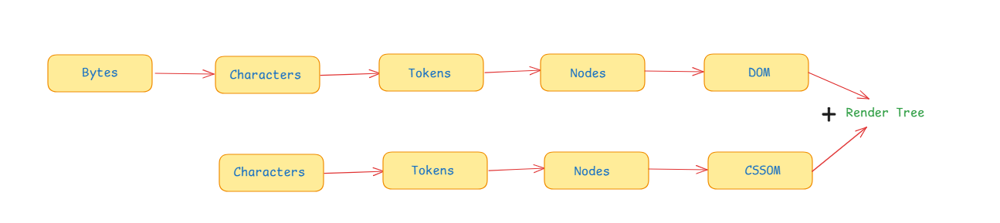
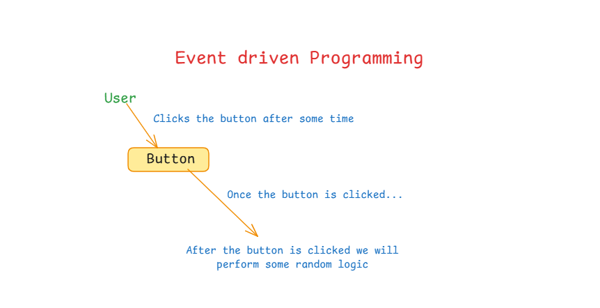
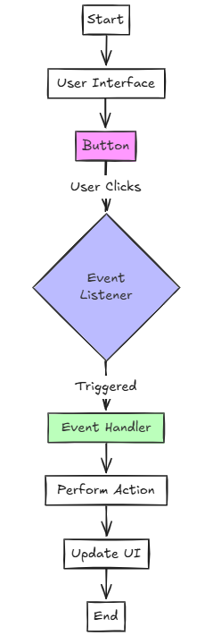

# Async JS :-

## Callbacks and HOF :-

### Callbacks -

are functions passed as arguments to other functions.

### HOF(Higher Order Function) -

are functions that take other functions as arguments or return functions as output.

```javascript
const arr = [1, 2, 3, 4];

arr.map(function f() {});
```

Here , `map` is a HOF that takes a function as an argument. And `f` is a callback function passed to `map` function.

```js
const arr = [1, 2, 3, 4];

function myMap(arr, fn) {
  let result = [];
  for (let i = 0; i < arr.length; i++) {
    result.push(fn(arr[i]));
  }
  return result;
}

console.log(
  myMap(arr, function g(x) {
    return x * 2;
  })
);
```

Here, `myMap` is a HOF that takes a function as an argument and returns a new array. And the function passed to `myMap` is a callback function.

### Disadvantages of Callbacks -

- Callbacks can lead to callback hell.
- Inversion of control.

#### Callback Hell :

```JS
fs.readdir(source, function (err, files) {
  if (err) {
    console.log('Error finding files: ' + err)
  } else {
    files.forEach(function (filename, fileIndex) {
      console.log(filename)
      gm(source + filename).size(function (err, values) {
        if (err) {
          console.log('Error identifying file size: ' + err)
        } else {
          console.log(filename + ' : ' + values)
          aspect = (values.width / values.height)
          widths.forEach(function (width, widthIndex) {
            height = Math.round(width / aspect)
            console.log('resizing ' + filename + 'to ' + height + 'x' + height)
            this.resize(width, height).write(dest + 'w' + width + '_' + filename, function(err) {
              if (err) console.log('Error writing file: ' + err)
            })
          }.bind(this))
        }
      })
    })
  }
})

```

See the pyramid shape and all the `})` at the end? Eek! This is affectionately known as callback hell.

#### Inversion of control :

Inversion of Control (IoC) is a design principle where the flow of control is inverted. Instead of your code directly calling dependencies, a framework or container manages and provides them.

## Async Programming :-

### Sync and Async :-

- **Sync** : When a function is called, it waits for the result before moving on to the next line of code. This is the default behavior of JavaScript.
- **Async** : When a function is called, it does not wait for the result before moving on to the next line of code. It continues executing other code while waiting for the result.

### What is default nature of JS :

Any native piece of code in JavaScript is synchronous. When you call a function, it will wait for the result befor
moving on to the next line of code.

```JS
for(let i = 0; i < 10000000; i++) {
  // console.log(i);
}

for(let i = 0; i < 10000; i++) {
  // something
}

console.log("end");

```

### Why JS is synchronous in nature ?

JS is single threaded. It can only execute one line of code at a time. This is why it is synchronous in nature.

### Core and Thread in JS:

- A CPU core can run only one thread at a time
- JS is single-threaded, meaning it can only execute one operation at a time in a single sequence
- JS cannot create additional threads like other languages (Java, Python)
- This design choice keeps JS simple and prevents concurrent memory conflicts

```JS
setTimeout(function f(){
  console.log("setTimeout");
},5000);

console.log("end");
```

The code will print "end" first and then "setTimeout" after 5 seconds.
The `console.log("end")` statement is executed immediately, and then the `setTimeout` function is called after 5 seconds.
In the above code, the `setTimeout` function is asynchronous. It does not block the execution of the code.

### runtime envoirnment :-

Runtime environment is the environment in which the code is executed. A JavaScript runtime environment is a platform that provides everything needed to execute JavaScript code outside of a web browser. It includes the browser, Node.js, etc.

image for runtime environment

```JS
setTimeout(function f(){
  console.log("setTimeout");
}, 10);

let x = 0;

while(x < 10000000) {
  x++;
}
```

In the above code, the `setTimeout` function is executed immediately, but the `while` loop is executed synchronously. The `while` loop is executed until `x` is less than 10,000,000 . The `setTimeout` function is executed after the `while` loop is finished. This is because the `while` loop is synchronous, and it blocks the execution of the code until it is finished. The `setTimeout` function is asynchronous, and it does not block the execution of the code. It is executed after the `while` loop is finished.

```JS
setTimeout(function f(){
  console.log("setTimeout");
}, 10);

setTimeout(function g(){
  console.log("Hello");
}, 5);

let x = 0;

while(x < 10000000) {
  x++;
}
```

In the above code, the `setTimeout` function `g` is executed before the `setTimeout` function `f`. This is because the `setTimeout` function `g` has a smaller timeout value (5) than the `setTimeout` function `f` (10). The `setTimeout` function `g` is executed after the `while` loop is finished. The `setTimeout` function `f` is executed after the `setTimeout` function `g` is finished. This is because the `setTimeout` function `f` has a larger timeout value (10) than the `setTimeout` function `g ` (5). The `setTimeout` function `f` is executed after the `while` loop is finished.

### Event loop :-

The event loop is a mechanism that allows JavaScript code to execute asynchronously. It is a queue that holds all the tasks that need to be executed, and it executes them one by one. The event loop is responsible for managing the execution of asynchronous code. It is the core of the JavaScript runtime environment.

The event loop is a single-threaded mechanism. It executes tasks one by one, and it does not allow multiple tasks to be executed simultaneously. This is because the event loop is designed to handle a single task at a time. It is not designed to handle multiple tasks simultaneously.

- Example :

```JS
function createTimer(time, timerId){
  console.log("Creating a new timer with id: ", timerId);
  setTimeout(() => {
    console.log("Timer with id: ", timerId, " has expired");
    }, time);
    console.log("Successfully created a new timer with id: ", timerId);
}

console.log("Starting the code.");
createTimer(3000, 1);
createTimer(0, 2);
console.log("Strating a loop");
for(let i = 0; i < 100000000; i++){
  // console.log("Loop iteration: ", i);
}
console.log("Loop is done");
console.log("Last line of the code");

```

Output of the code =>

```
Starting the code.
VM49:2 Creating a new timer with id:  1
VM49:6 Successfully created a new timer with id:  1
VM49:2 Creating a new timer with id:  2
VM49:6 Successfully created a new timer with id:  2
VM49:12 Strating a loop
VM49:16 Loop is done
VM49:17 Last line of the code
undefined
VM49:4 Timer with id:  2  has expired
VM49:4 Timer with id:  1  has expired
```

In this code, the `timerId` variable is accesible even after complete execution of the `createTimer` function.(Outside of it's scope)
This is because -

`Closures` :-
is a mechanism using which a function remembers the variable present in the outer function scope, even when outer function execution is completed.

In JavaScript, a closure is a function that has access to its outer function's scope, even when the outer function has returned. This is because the inner function "remembers" the variables of
the outer function, and can access them even after the outer function has returned. This is known as a closure.

## Promises in JS :-

Promises are used to handle asynchronous operations in JavaScript. They are used to handle the result of an asynchronous operation, such as a network request or a database query.

- Promises are readability enhancers.
- They are a special JS objects, which can help us to control future related tasks.(eg. - dowload some file, using a timer etc.)

```JS
function download(url, callback){
  console.log("Downloading from", url);
  setTimeout(() => {
    console.log("File downloaded");
    let dowloadedData = "Some data";
    callback?.(dowloadedData);
  }, 3000);
}

function writeFile(data, fileName, callback){
  console.log("Writing", data, "to", fileName);
  setTimeout(() => {
    console.log("File written");
    callback?.();
    }, 2000);
}

function upload(fileName, url, callback){
  console.log("Uploading", fileName, "to", url);
  setTimeout(() => {
    console.log("File uploaded");
    let uploadStatus = "Success";
    callback?.(uploadStatus);
    }, 3000);
}

function process(){
  download("https://example.com/file1.txt", (data) => {
    writeFile(data, "file1.txt", () => {
      upload("file1.txt", "someurl.com", (status) => {
        console.log("Upload status:", status);
      });
    });
  });
}

dowload("www.something.com", (data) => {
  console.log("Data downloaded: ", data);
});

process();

```

Output of the code :-

```
Downloading from https://example.com/file1.txt
undefined
VM45:4 File downloaded
VM45:11 Writing Some data to file1.txt
VM45:13 File written
VM45:19 Uploading file1.txt to someurl.com
VM45:21 File uploaded
VM45:31 Upload status: Success
```

### <u><b>Two aspects of promise :-</b></u>

### <b>1. How to create a promise :-</b>

- In JavaScript we have a promise constructor.

Syntax--

```JS
new Promise(cb)
```

=> This counstructoe expects a callback in te argument, this callback is called Executor callback.

Que. Why this is called executor callback??

=> Because when we create a promise object at that point of time, our counstructor will execute this callback.

That means this callback is executed by promise constructor immediately.

Syntax--

```
new Promise((resolve, reject) => {
  // code to be executed
  // resolve and reject are the functions, which are passed to the executor callback.
  // We will be using these functions inside the executor function.
})

```

Because, Promise constructor is responsible for executing the `executor` callback, it becomes the role of promise counstructor to give the definition of `resolve` and `reject` function.

```JavaScript
const pr = new Promise((resolve, reject) => {
  console.log("Executor callback triggered by Promise constructor");
});

console.log("Created the promise object");
console.log(pr);
```

Output=>

```
Executor call back triggered by Promise constructor
Created the promise object
Promise {<pending>}
```

<b>2. How does a promise object look like? :-</b>
Promise object have two properties:

- `status` :- This is a property of promise object, which is used to track the status of promise object.
- `value` :- This is a property of promise object, which is used to track the value of promise object.

At any point of time, a promise object can be in one of the three states:

1. Pending
2. Fulfilled
3. Rejected

A promise object is in pending state when it is created. It is not yet resolved or rejected. This is the starting state of the promise object. It is the initial state of the promise object.

Our promise object cans change its state only once i.e., it can be resolved only once and it can be rejected only once.
](images/pendingPromise.png)

If inside the executor callback, we call the `resolve` function, then the promise object will change its state from pending to fulfilled . If we call the `reject` function inside the executor callback, then the promise object will change its state from pending to rejected.

```JS
const pr = new Promise(function exec(resolve, reject){
  console.log("Executor callback triggered by Promise constructor");
  const random = Math.floor(Math.random()*100);
  if(random % 2 === 0){
    resolve();
  }
  else{
    reject();
  }
});

console.log("Created the promise object");
console.log(pr);
```

`Value :-`
The value of a promise object is the value that is passed to the `resolve` function inside the executor callback. If the `resolve` or `reject` function is called with a value, then the value of the promise object will be that value. If the `reject` or `resolve ` function is called without a value, then the value of the promise object will be undefined.

There are two more hidden properties:-
These are in the form of array. These arrays are internally managed by promise and initially they are empty. We can store some functions in both of the arrays using the `.then()` and `.catch()` methods. These functions are called when the promise object is resolved or rejected. These functions are called with the value of the promise object as an argument.

These function remains in their respective arrays till the time promise object is in pending state. Once the promise object is resolved or rejected, these functions are removed from their respective arrays.

If the promise moves to the fullfilled state, all the function stored in the onfullfillment array is queued in a new queu in the memory called `MicroTask` queue and onRejected array does not get affected.<br> If the promise moves to the rejected state, all the function stored in the onRejected array is queued in a new queue in the memory called `MicroTask` queue and onFulfillment array does not get affected.

- `onFulfilled` :- This is a property of promise object, which is used to track the function that will be called when the promise object is in fulfilled state. This function is called when the promise object is resolved.
- `onRejected` :- This is a property of promise object, which is used to track the function that will be called when the promise object is in rejected state. This function is called when the promise object is rejected.

### <b> 2. How to consume promise :- </b>

Promises acts as a placeholder object for something that will come in future.<br>
Once the future execution is done, then we might want to execute some algorithms based on if the futuire was a failure or success. <br>
To do this, we can use the `.then()` method of the promise object. This method takes two arguments, one for the case when the promise object is in fulfilled state and another for the case wh n the promise object is in rejected state. <br>
The `.then()` method returns a new promise object. <br>


```JS
console.log("start");

setTimeout(() => {
  console.log("timer1 done");
}, 2000);

const pr = new Promise(function exec(resolve, reject){
  console.log("Executor callback triggered by Promise constructor");
  setTimeout(() => {
    const randomNum = Math.floor(Math.random()*100);
    console.log(randomNum);
    if(randomNum % 2 === 0){
      resolve(randomNum);
    }
    else{
      reject(randomNum);
    }
  }, 4000);
});

pr.then(function f(){console.log("executing f")}, function g(){console.log("executing g")});
pr.then(function h(){console.log("executing h")}, function i(){console.log("executing i")});

for(let i = 0; i < 100000000; i++) {};
for(let i = 0; i < 100000000; i++) {};

console.log("end");
```
Output=>
```
start
Executor callback triggered by Promise constructor
end
undefined
timer1 done
0
executing f
executing h
```
In the above code, we have created a promise object `pr` and then we have used the `.then()` method to execute two functions `f` and `h` when the promise object is in fulfilled state and two functions `g` and `i` when the promise object is in rejected state.

- .then(f, g) does only registration, it does not execute the functions f and g. It returns a new promise object. 
- .then(f, g) can be chained to the same promise object multiple times.
- .then(f, g) returns a new promise object.
- We can expect promise value as argument in the function f and promise reason as argument in the function g.

<b>Return type of .then() method -</b>
The return type of .then() method is a new promise object. It does not return the result of the function f or g. It returns a new promise object. This new promise object is resolved with the return value of the function f or g.

```JS
const p1 = new promise((res, rej) => {
  setTimeout(() => {
    console.log("Timer of p1 done");
    res(100);
  }, 500);
});

const p2 = p1.then(function a(){console.log("a")}, function b(){console.log("b")});

const p3 = p2.then(function c(){console.log("c")}, function d(){console.log("d")});

```
In the above code, `p2` is a new promise object which is resolved with the return value of the function `a` or `b`. `p3` is a new promise object which is resolved with the return value of the function `c` or `d`. <br>
The responsibility of resolving `p2` is with the function `a` or `b`.

`p2 = p1,then(f)` - Whenever f is executed(when it gets the chance) and returns a value properly only at that time
`p2` state goes to fulfilled state and value becomes equal to return value of f.<br>
If f returns a promise then `p2` state goes to pending state and `p2` is resolved with the value of the returned promise.<br> 
If f returns a value then `p2` state goes to fulfilled state and value becomes equal to return value of f.<br> 
If f throws an exception then `p2` state goes to rejected state and reason becomes equal to the exception thrown by f.<br> 
```JS
const p1 = new Promise((res, rej) => {
  setTimeout(() => {
    console.log("Timer of p1 done");
    res(100);
  }, 5000);
});

const p2 = p1.then(function a(){
  console.log("going to fullfill p2")
});
```
Output =>


In the above code, initially `p2` is in pending state. When `p1` is resolved then `p2 ` is resolved with the value of the returned promise. <br> 
The responsibility of resolving `p2` is with the function `a`. <br>


## Iterator & Generator :-
### Iterator :-
An iterator is an object that defines a sequence and keeps track of the position in the sequence. It is used to traverse the elements of a collection, such as an array or a string.

In JS , an iterator is an object that implements the `Symbol.iterator` method, which returns an iterator object . The iterator object has a `next()` method that returns an object with three properties: `value `, `done`, and `key` (for arrays).
- `value` is the current value of the iterator.
- `done` is a boolean indicating whether the iterator is done (i.e., whether there are more values to iterate over).
- `key` is the current index of the iterator (for arrays). 


### Generator :-
A generator is a special type of function that can be paused and resumed during its execution. It is used to create iterators. A generator function returns an iterator object, which can be used to iterate over the values produced by the generator. 

```JS
function* myGenerator(){
  console.log("Inside generator")
  yield 1;
  console.log("Line 2")
  yield 2;
  console.log("Line 3")
  yield 3;
}
console.log("Outside");
const gen = myGenerator();
console.log(gen.next().value); // 1
console.log(gen.next().value); // 2
console.log(gen.next().value); // 3
```
Output :
Inside generator
Outside
1
Line 2
2
Line 3
3

In the above code, `myGenerator` is a generator function. It uses the `yield` keyword to produce values. The `next()` method is used to get the next value from the generator. The `done` property of the iterator object returned by `next()` is used to check whether the generator is done. If `done` is `true`, it means the generator is done and there are no more values to iterate over.

### Generator vs Iterator :-
- Both generators and iterators are used to create sequences of values.
- Both can be used to iterate over collections.
- Both can be used to create custom iteration protocols.
- However, generators are a special type of function that can be paused and resumed during its execution,
whereas iterators are objects that implement the `Symbol.iterator` method.

Ref : <a href="https://developer.mozilla.org/en-US/docs/Web/JavaScript/Guide/Iterators_and_generators">Iterators & Generators</a>

## Async Await :-
```JS
function download(url){
  return new Promise(function exec(res, rej){
    console.log("Downloading from", url);
    setTimeout( function() {
      let data = "Some data from " + url;
      console.log("Downloaded dat from", url);
      res(data);
  }, 3000);
  });
}

function writeFile(data, fileName, callback){
  return new Promise(function exec(res, rej){
    console.log("Writing to file", fileName);
    setTimeout(() => {
      console.log("Wrote to file", fileName);
      let status = "Success";
      res(status);
    }, 2000);
  });
}

function upload(fileName, url, callback){
  return new Promise(function exec(res, rej){
    console.log("Uploading to", url);
    setTimeout(() => {
      console.log("Uploaded to", url);
      let uploadStatus = "Success";
      res(status);
    }, 2000);
  });
}

function* exec(){
  console.log("starting Execution");

  const downloadData = yield download("https://example.com/file1.txt");
  console.log("Downloaded Data:", downloadData);

  const fileResponse = yield writeFile(downloadData, "file1.txt");
  console.log("File Response:", fileResponse);

  const uploadStatus = yield upload("file1.txt", "https://example.com/upload");
  console.log("Upload Status:", uploadStatus);

  return uploadStatus;
  
}

const it = exec();

const ft = it.next();
console.log("ft is", ft);
ft.value.then(function afterReceivng(value){
  console.log("Received value:", value);

  it.next(value);
});

```
This code defines three functions: `download`, `writeFile`, and `upload`. These functions are designed to mimic the behavior of asynchronous operations, such as downloading a file, writing to a file, and uploading a file. The `exec` function is a generator function that orchestrates the execution of
these operations using the `yield` keyword. The `it.next()` method is used to advance the generator and execute the next operation. The `then` method is used to handle the result of the operation and pass it to the next operation. The code uses Promises to handle the asynchronous operations and the `yield` keyword to pause the execution of the generator until the operation is complete.
The code is written in JavaScript and uses the `async/await` syntax to handle asynchronous operations. The `exec` function is a generator function that uses the `yield` keyword to pause the execution
of the generator until the operation is complete. The `then` method is used to handle the result of the operation and pass it to the next operation. The code uses Promises to handle the asynchronous operations and the `yield` keyword to pause the execution of the generator until the operation is complete.

### What is async await ?
Async/await is a syntax in JavaScript that allows you to write asynchronous code that looks and feels like synchronous code. It's a way to write asynchronous code that's easier to read and understand.

### Async function :-
- We will be allowed to use await keyword inside the function. 
- The function will return a promise.
- If we have an async function  returning a non promise value(like object, Stringn null etc.), then async function will create a ner Promise in the memory and then immediately fulfill the Promise using the returned value. Hence we get an already fulfilled promise.
- If we have an async function returning a promise, then the async function will return the promise as it is.
- If we have an async function returning a promise that is rejected, then the async function will return the rejected promise. Hence we get an already rejected promise. 
- Whenever we hit await keyword, the execution of the function will be paused until the awaited promise is resolved or rejected.
- If the awaited promise is resolved, then the execution of the function will resume from the line after the await keyword.
- If the awaited promise is rejected, then the execution of the function will pause and the catch block will be executed. 
- Async function internally uses generator iterator concept but they do not need to be manually controlled by us . They are automatically controlled by the async/await syntax and its execution starts immediately.
- We can use try catch block inside an async function to catch the errors that occur during the execution of the function. The catch block will be executed when the awaited promise is rejected. 


```JS
async function exec(){
  console.log("starting Execution");
  const downloadData = await download("https://example.com/file1.txt");
  console.log("Downloaded Data:", downloadData);

  const fileResponse = await writeFile(downloadData, "file1.txt");
  console.log("File Response:", fileResponse);

  const uploadStatus = await upload("file1.txt", "https://example.com/upload");
  console.log("Upload Status:", uploadStatus);

  return uploadStatus;
}

exec().then((v) => console.log("exec done", v));
```
In the above code, the `exec` function is an async function that uses the `await` keyword to pause the execution of the function until the awaited promise is resolved or rejected. The `download`, `writeFile`, and `upload` functions are called using the `await` keyword, and their results are logged to
the console. The `exec` function returns a promise that resolves with the result of the `upload ` function. The `then` method is used to handle the result of the `exec` function and log it to the console. The code uses Promises to handle the asynchronous operations and the `await` keyword to pause the execution of the function until the operation is complete. 

### Promise vs callback function:-
|Promise|Callback|
| --- | --- |
|Promise is an object that represents the eventual completion (or failure) of an asynchronous operation and its resulting value.|Callback is a function that is passed as an argument to another function, which is the invoked when a specific task is completed. | 
|Promise is used to handle asynchronous operations in a more readable and maintainable way.|Callback is used to handle asynchronous operations in a more traditional way. | 
|Promise is a more modern and widely adopted approach to handling asynchronous operations.|Callback is a more traditional and widely used approach to handling asynchronous operations. | 
|Promise is more flexible and can be used with multiple asynchronous operations.|Callback is less flexible and is typically used with a single asynchronous operation. | 
|Promise can be resolved or rejected with a value only once.|Callback can be invoked multiple times. |

Ref: <a href="https://developer.mozilla.org/en-US/docs/Web/JavaScript/Reference/Global_Objects/Promise">Promises</a>


# DOM :-
The Document Object Model (DOM) is a programming interface for HTML and XML documents. It represents the structure of a document as a tree-like data structure. The DOM is used to interact with the document , such as getting and setting the values of elements, adding and removing elements, and handling events.

### DOM Tree:
The DOM tree is a hierarchical representation of the document. It consists of nodes, which are objects that represent elements, attributes, and text. The nodes are connected by edges, which represent the relationships between them.

### Tokenization- 
Tokenization is the process of breaking down a string into individual tokens, which are the smallest units of the string that have meaning in the context of the language. In the context of the DOM, token ization is used to break down the HTML or XML document into individual elements, which are represented as nodes in the DOM tree. 

### CSSOM-
The CSS Object Model (CSSOM) is a programming interface for CSS stylesheets. It represents the styles applied to the document as a tree-like data structure. The CSSOM is used to interact with the styles, such as getting and setting the values of styles, adding and removing styles, and handling events. 

### DOM vs CSSOM-
|DOM|CSSOM|
| --- | --- |
|DOM represents the structure of the document as a tree-like data structure.|CSSOM represents the styles applied to the document as a tree-like data structure. |
|DOM is used to interact with the document, such as getting and setting the values of elements, adding and removing elements, and handling events.|CSSOM is used to interact with the styles, such as getting and setting the values of styles, adding and removing styles, and handling events. | 
|DOM is a more fundamental and low-level interface than CSSOM.|CSSOM is a higher-level interface that builds on top of the DOM. | 
|DOM is used to manipulate the structure of the document.|CSSOM is used to manipulate the styles applied to the document. | 



### Render tree-
The render tree is a tree-like data structure that represents the visual representation of the document. It is created by combining the DOM tree and the CSSOM tree. The render tree is used by the browser to determine how to render the document.

### Layout-
Layout is the process of calculating the position and size of elements in the render tree. It is used to determine how the elements will be displayed on the screen. 

### Paint-
Paint is the process of drawing the elements in the render tree onto the screen. It is used to render the visual representation of the document. 

### BOM-
The Browser Object Model (BOM) is a programming interface for the browser. It represents the browser as an object, which can be used to interact with the browser, such as getting and setting the values of properties, adding and removing properties, and handling events. 

### BOM vs DOM-
|BOM|DOM|
| --- | --- |
|BOM represents the browser as an object.|DOM represents the document as an object. |
|BOM is used to interact with the browser, such as getting and setting the values of properties , adding and removing properties, and handling events.|DOM is used to interact with the document, such as getting and setting the values of elements, adding and removing elements, and handling events. |
|BOM is a higher-level interface than DOM.|DOM is a more fundamental and low-level interface than BOM. |
|BOM is used to manipulate the browser.|DOM is used to manipulate the document. |

#### Window Object-
The Window object is the top-level object in the BOM. It represents the browser window and provides access to the document, history, and other browser features. 


## DOM Manipulation:-

### Event driven programming-
Event-driven programming is a programming paradigm in which the flow of the program is determined by events such as user interactions, network requests, and timer events. In the context of the DOM, event-driven programming is used to handle events such as clicks, mouseovers, and key presses. 




### DOM Content Loaded-
The DOMContentLoaded event is fired when the initial HTML document has been completely loaded and parsed, without waiting for stylesheets, images, and subframes to finish loading. This event is used to execute code when the document is fully loaded.

### document Object-
The document object is the top-level object in the DOM. It represents the document and provides access to the document's elements, attributes, and methods. The document object is used to interact with the document , such as getting and setting the values of elements, adding and removing elements, and handling events. 

